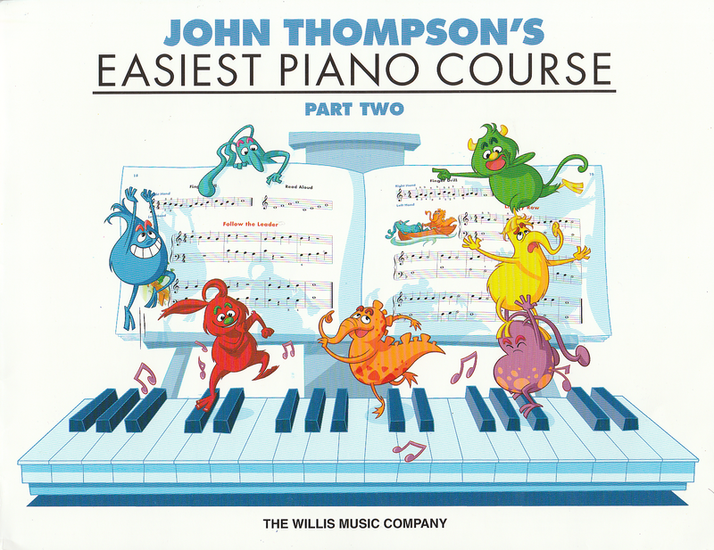

---
tags:
  - John Thompson's
---

# Easiest Piano Course Part 2

- School Days
- Playing Tag
- Through the Woods
- The Trombone Player
- Oh, Susanna
- Ten Little Dancers
- The Bells Ring Out
- Sunrise
- The Ballet Dancer
- Three Blind Mice
- The Dancing Kangaroo
- Follow the Leader
- Lightly Row
- Setting-Up Exercise
- Serenade
- The Pipers Are Coming!
- Once Upon a Time
- The Wishing Star
- Mountain Climbing
- Maypole Dance
- Little Bo-Peep
- Evening Song
- The Skater
- The Dancing Bear
- Theme from the "New World" Symphony
- Skip to My Lou
- London Bridge Is Falling Down
- The Giant Steps
- Turkey in the Straw
- Tom-Toms
- Sweet and Low
- Prelude, Op. 28, No. 20
- Greetings
- The Band Played On
