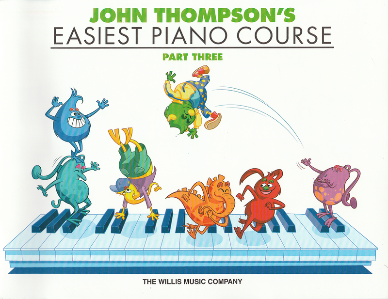

---
tags:
  - John Thompson's
---

# Easiest Piano Course Part 3

- Melody
- The Bee
- Much Ado About Nothing
- Some Folks Do
- At the Animal Fair
- On the Levee
- Sunrise
- Pop Goes the Weasel
- Boogie Woogie Bill
- Robin Redbreast
- Shufflin' Along
- Shadow Dance
- The Juggler
- Acrobats
- I Like Rhythm
- Tribal Dancere
- Cake Walk
- Chord Capers
- Broken Chord Etude
- An Old Folk Tune
- Cross-Hand Etude
- Chinese Theatre
- Peasant Dance
- Etude in B-Flat
- O Sole Mio
- Cowboy's Song
- A Little Bit of Rag
- Holiday Song
- Tramp, Tramp, Tramp
- By Moonlight
- How D'ye Do?
