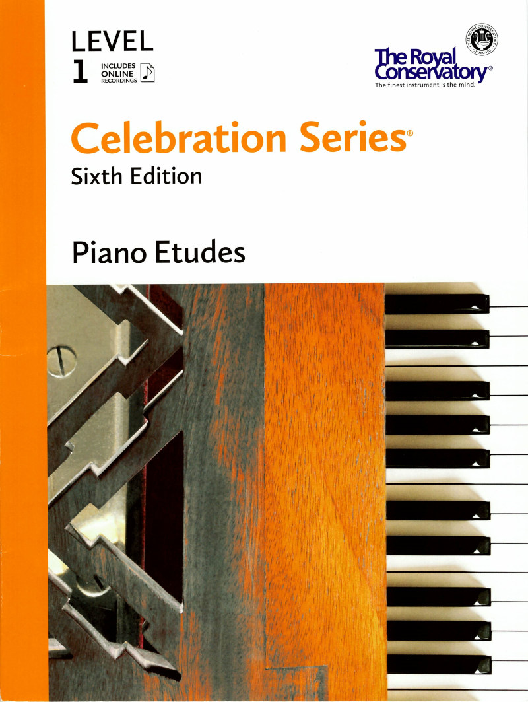

---
tags:
  - RCM
---

# RCM Level 1 Piano Etudes

{style="width:50%"; loading=lazy}

- Celebration
- Etude in C Major, op. 125, no. 3
- Heavenly Blue
- Clockwork
- Beaver Boogie
- Morning Greeting, op. 117, no. 13
- Morning Fanfare (Wake up)
- Etude in C Major
- Both Ways
- Tricky Traffic
- Speedy Comet
- Far Away
- Answering
- Jump Pop Hop
- Melodie in F Major, op. 218, no. 36
- Into the Waves
- Detectives
- Scherzo, op. 12
- Four-Wheel Drive
