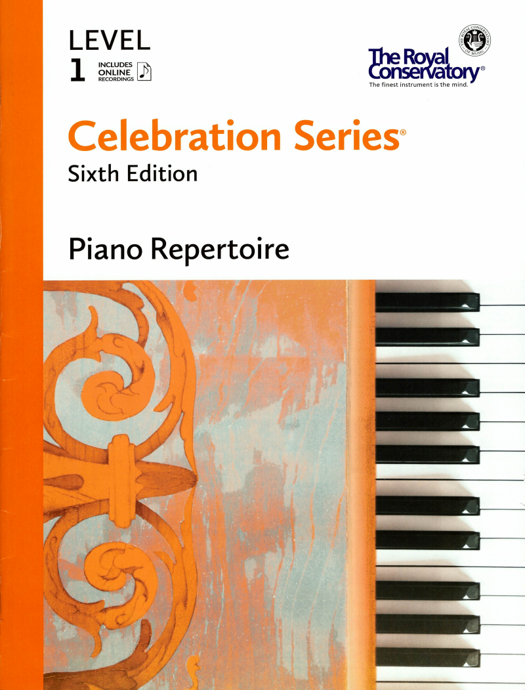

---
tags:
  - RCM
---

# RCM Level 1 Piano Repertoire

{style="width:50%"; loading=lazy}

- Minuet in C Major, op. 38, no. 4
- Bourree in D Minor
- Burlesque in D Minor
- Andante in G Minor
- German Dance in D Major, Hob. IX:22, no. 2
- Gavotte in G Major
- Minuet in C Major
- Minuet in D Minor
- High Spirits
- Ukraninian Folk Song, op. 107, no. 3
- Early One Morning
- The Swiss Cuckoo
- Sweet Jasmine
- Niimi Aandeg (Crow Dances)
- This Guy's Disguised
- Lunar Eclipse
- March of the Terrible Trolls
- Mist
- Clear Mountain Sky
- Angelfish
- A Simple Waltz
- Waltz, op. 39, no. 13
- Song of the Dark Woods
- Reminiscence
