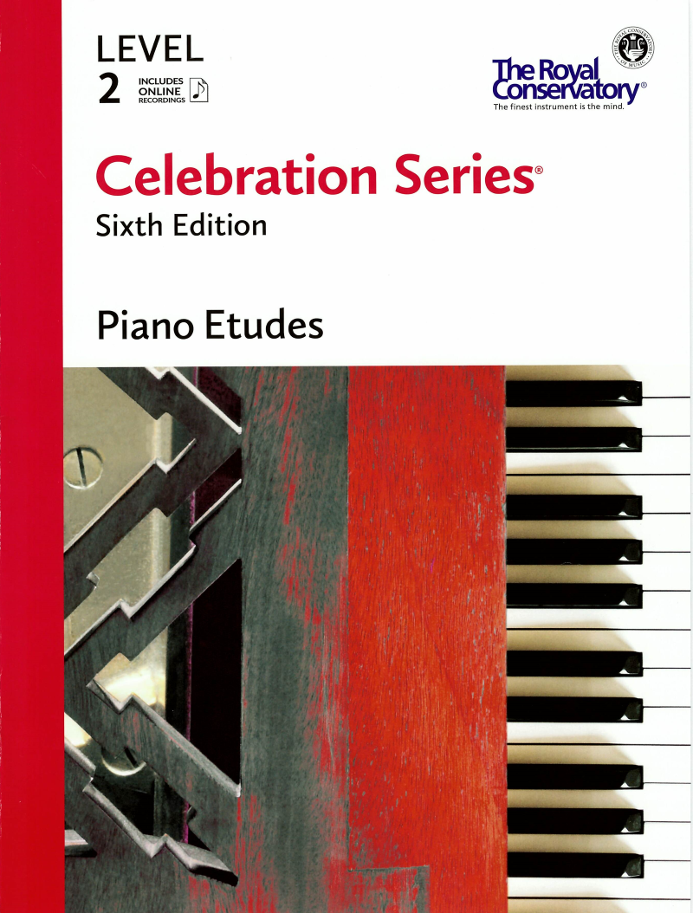

---
tags:
  - RCM
---

# RCM Level 2 Piano Etudes

{style="width:50%"; loading=lazy}

- Etude in F Major, op. 190, no.27
- Allegro in C Major, op. 38, no. 8
- Etude in D Major, op. 139, no. 33
- Etude in D Minor, op. 82, no. 65
- Pierrot Skipping (Pierrot sautille)
- The Little Juggler, op. 89, no. 21
- Bird in the Bebop
