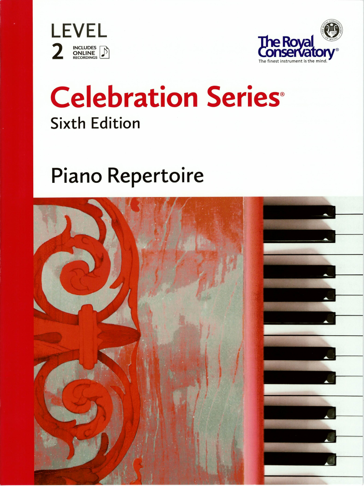

---
tags:
  - RCM
---

# RCM Level 2 Piano Repertoire

{style="width:50%"; loading=lazy}

- Entree in A Minor
- Menuet en rondeau (Minuet in Rondo Form)
- Minuet in G Major
- Impertinence, HWV 494
- Minuet in A Minor, Z 649
- A Cheerful Spirt
- Minuet in G Major, K 1e
- German Dance in G Major, Hob. IX:12, no. 1
